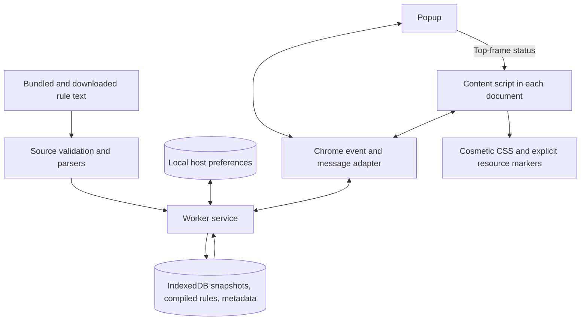

# Clearspace architecture

Clearspace has three runtime owners. The service worker owns rule data and host
preferences. Each content script owns cleanup for one document. The popup owns
user interaction with those two actors.

## Find the owner of a change

| Change | Owner | Verification |
| --- | --- | --- |
| Source acceptance, size limits, conditional downloads | `src/source-validation.js` | `tests/source-validation.test.mjs` |
| EasyList parsing and cosmetic exceptions | `src/easylist.js` | `tests/easylist.test.mjs` |
| HaGeZi parsing | `src/hagezi.js` | `tests/hagezi.test.mjs` |
| Host normalization, private defaults, exact-host policy | `src/hosts.js` | `tests/hosts.test.mjs` |
| Worker initialization, refresh, cache publication, alarms | `src/worker-service.js` | Packaged browser scenarios in `scripts/smoke.mjs` |
| IndexedDB schema and atomic source replacement | `src/db.js` | Browser restart and failed-refresh scenarios |
| Message names and payload contracts | `src/protocol.js` | `tests/protocol.test.mjs`, `tests/typecheck/protocol.js` |
| Chrome worker events and message dispatch | `background.js` | Packaged browser scenarios |
| CSS injection, resource classification, DOM observation | `src/content/entry.js` | Browser cosmetics, resources, and frame scenarios |
| Toolbar controls and status | `popup.js`, `popup.html`, `popup.css` | Browser popup scenarios and screenshot capture |
| Release contents and content-script compilation | `scripts/package.mjs` | Package the extension, then run browser scenarios |
| Tool versions and common tasks | `mise.toml` | `mise run check` |

## Follow the data

The worker initializes once per worker lifetime. Missing rule sources come from
bundled seeds, so startup does not need network access. It hydrates matchers from
IndexedDB and retains an existing daily alarm's deadline.

A source refresh validates and hashes a download before replacing the source's
snapshot, compiled rules, and metadata in one transaction. The worker publishes
the new matcher after the transaction succeeds. A failed source retains its
last-known-good rules and does not prevent the other source from updating.

A content script asks for the current document's selectors. If the hostname is
enabled, the script injects CSS, classifies resource hostnames, and observes DOM
changes. An identified resource can hide itself and an explicitly marked ad
slot. It cannot collapse an arbitrary ancestor.

The popup reads site status from frame zero without requesting source metadata.
It shows the site switch and keeps manual updates in a collapsed disclosure.
It stores an exact-host preference, reloads the tab, and closes. A failed save
restores the previous switch state. If the save succeeds but reload fails, the
popup retains the saved state and asks the user to reload. Source refreshes and preference changes take effect
in documents on navigation. There is no live reconfiguration protocol.
The worker serializes preference writes because each update reads and replaces
the same stored record. Concurrent toggles must retain both hostname changes.

## Keep contracts at their owners

All maintained runtime source uses JavaScript modules. JSDoc contracts are
checked by TypeScript. The protocol module owns request names and payload shapes;
callers import them instead of copying strings. Chrome event and message
boundaries belong in `background.js`. The worker service owns the mutable state
needed to complete each operation.

The parsers remain independent of Chrome. IndexedDB transactions remain in
`src/db.js`. There is no framework, generic service registry, or runtime
dependency-injection container.

## Build the browser artifact

The worker and popup remain browser modules. Chromium loads the content script
as a classic script, so packaging bundles `src/content/entry.js` and its imports
into `dist/unpacked/clearspace-<version>/content.js`. The manifest keeps the same
entrypoint paths. Generated files live in `dist/` and are not edited or committed.

Only the content script needs bundling. This keeps normal source imports without
introducing a shared global or making modules web-accessible. The bundler's
[build API](https://esbuild.github.io/api/#build) emits the classic script;
[checkJs](https://www.typescriptlang.org/tsconfig/checkJs.html) checks the maintained
JavaScript before release.

## Preserve these external contracts

- Clearspace is cosmetic-only. Keep the manifest permissions and two source URLs
  narrowly scoped. Do not add request interception or export visited hosts.
- IndexedDB remains `clearspace-rules`, version 1. Its `snapshots`, `compiled`,
  and `metadata` stores use `sourceId` keys and retain their existing record shapes.
- `chrome.storage.local.hostPreferences` retains `disabledPublicHosts` and
  `enabledPrivateHosts`. Host preferences match exactly.
- Public HTTP(S) hosts default to enabled. Private hosts default to disabled.
- Messages retain version 1, their existing type strings, and `ok` response
  envelopes. Content scripts run in every matching frame at `document_start`.
- Preserve offline seeds, source-specific failures, conditional refreshes, the
  32 MiB limit, validation thresholds, and last-known-good replacement.
- The daily alarm keeps its saved deadline across worker restarts. A failed
  scheduled source refresh gets one retry after one hour.

## Verify a change

Run `mise run check` to check types, run unit tests, package the extension, and
exercise the packaged extension in Chromium. `mise run test:browser` rebuilds
before opening Chromium, so that task cannot silently test a stale bundle.
Compile-time contract fixtures reject missing request payloads and inconsistent
refresh results. `mise run install:browser` installs Chromium through the locked
Playwright package when a system browser is unavailable.

The browser suite uses isolated profiles and local fixtures. It covers cosmetic
exceptions, resource and ancestor boundaries, frames, private-host exclusion,
popup controls, worker restart, alarm persistence, and independent refresh
failure. Concurrent site toggles must retain both saved preferences. The suite
does not install the extension in your normal browser profile.

To inspect popup appearance, set `CLEARSPACE_POPUP_SCREENSHOT` to a path under
`artifacts/` when running `mise run test:browser`. The capture uses a device scale
of two.
