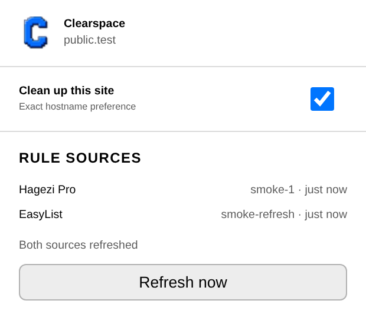
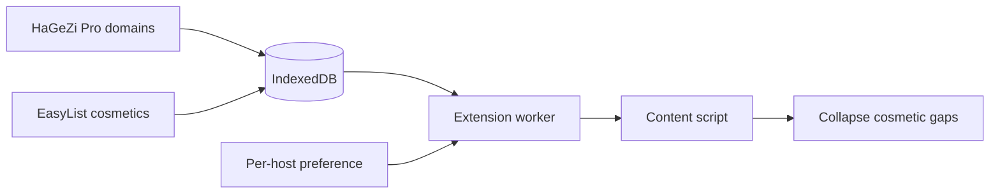

<p align="center">
  
</p>

<h1 align="center">Clearspace</h1>

<p align="center">
  A privacy-conscious cosmetic companion for DNS and network blockers.
</p>

<p align="center">
  <a href="https://github.com/astrazds/clearspace/actions/workflows/ci.yml"></a>
  <a href="LICENSE"></a>
</p>

Clearspace is a small Manifest V3 extension that removes cosmetic ad gaps and
collapses known blocked-resource slots without intercepting browser requests.
It was originally developed alongside [Blocky](https://0xerr0r.github.io/blocky/),
but it does not depend on Blocky or communicate with any network blocker.

<p align="center">
  
</p>

## Why Clearspace?

Network-level blocking can stop an ad resource while leaving an empty container
behind. Clearspace handles that presentation layer locally. It applies a safe
subset of EasyList cosmetic rules and recognizes resource hostnames from HaGeZi
Pro, while keeping page classification and preferences inside the extension.

## Install

Clearspace is currently distributed as an unpacked extension. Chromium 152 is
the browser version presently tested; other Chromium releases with Manifest V3
support may also work.

1. Install [mise](https://mise.jdx.dev/) and run `mise install` to select the
   project's pinned Node.js version.
2. Build the unpacked directory:

   ```sh
   mise run install
   mise run package
   ```

3. Open `chrome://extensions`, enable **Developer mode**, and choose
   **Load unpacked**.
4. Select `dist/unpacked/clearspace-<version>`.

No ZIP archive is produced. The release command intentionally creates only the
directory Chromium needs for an unpacked installation.

## Use

Clearspace is enabled by default for public HTTP(S) sites. Open the toolbar
popup to disable or re-enable the exact hostname, inspect the two rule-source
versions, or request an immediate refresh. Local and private hosts are excluded
by default and can be enabled individually from their own page.



## Privacy and permissions

Clearspace has no telemetry and does not access cookies, browser history, DNS,
or a blocker API. It has no general host permission for browsing activity and
does not use `webRequest` or `declarativeNetRequest`.

The manifest permissions are deliberately narrow:

| Permission | Purpose |
| --- | --- |
| `storage` | Store exact-host preferences locally |
| `alarms` | Schedule daily rule refreshes and one bounded retry |
| `unlimitedStorage` | Retain validated offline rule snapshots in IndexedDB |

The only host permissions are the exact HTTPS URLs used to refresh HaGeZi Pro
and EasyList. See [PRIVACY.md](PRIVACY.md) for the full data boundary.

## Rules and offline behavior

The repository includes rule snapshots so first run works offline:

| Source | Bundled version | Bundled date | Refresh URL |
| --- | --- | --- | --- |
| HaGeZi Pro wildcard | `2026.0830.0806.07` | 30 Aug 2026 | [Source](https://raw.githubusercontent.com/hagezi/dns-blocklists/main/wildcard/pro.txt) |
| EasyList | `202608310103` | 31 Aug 2026 | [Source](https://easylist-downloads.adblockplus.org/easylist.txt) |

Updates are conditional, limited to 32 MiB, validated, hashed, and installed
atomically. Empty, malformed, oversized, or unexpectedly truncated downloads
leave the last-known-good snapshot intact. Sources refresh independently once a
day; a failed source receives one retry after one hour.

EasyList support is intentionally conservative: standard `##` and `#@#`
selectors, domain inclusion/exclusion, and page-level `elemhide` and
`generichide` exceptions. Procedural selectors, snippets, remove/style actions,
and network rules are ignored. HaGeZi entries are normalized and suffix-matched
locally. See [THIRD_PARTY_NOTICES.md](THIRD_PARTY_NOTICES.md) for source
attribution and licenses.

## Limitations

- Clearspace is cosmetic: it does not block network requests.
- The supported EasyList subset favors predictable page behavior over complete
  filter compatibility.
- A recognized blocked resource is hidden, but its ancestor is collapsed only
  when that ancestor is explicitly identifiable as an ad slot.
- Browser-store packaging and publication are not part of this repository.

## Project structure

| Path | Purpose |
| --- | --- |
| `background.js`, `src/worker-service.js` | Chrome event adapter and worker state |
| `src/content/entry.js` | Page-side behavior, bundled as classic `content.js` |
| `popup.*` | Exact-host controls and rule status UI |
| `src/` | Checked JavaScript for parsing, validation, persistence, protocol, and host logic |
| `rules/` | Bundled offline snapshots and local cosmetic overrides |
| `tests/`, `fixtures/` | Unit and browser acceptance coverage |
| `scripts/` | Unpacked packaging and Playwright smoke test |
| `mise.toml` | Pinned tool version and common development tasks |

Read [ARCHITECTURE.md](ARCHITECTURE.md) for ownership, data flow, compatibility
contracts, and the file and test to change for each subsystem.

## Development

```sh
mise install
mise run install
mise run typecheck
mise run test
mise run package
mise run test:browser
mise run check
```

`mise run check` checks runtime JavaScript contracts, runs unit tests, rebuilds
the unpacked extension, and runs the complete browser suite. The browser test
uses a system Chromium when available or Playwright's installed Chromium
(`mise run install:browser`). `mise run test:browser` also
rebuilds before testing. Edit source files instead of generated files in `dist/`.

Contributions are welcome; read [CONTRIBUTING.md](CONTRIBUTING.md) before opening
a pull request. Clearspace code is licensed under
[GPL-3.0-only](LICENSE).
